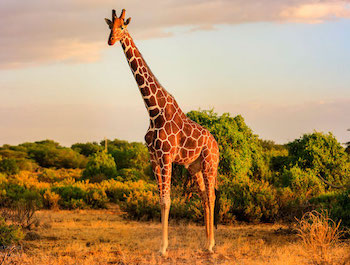

# animals
hello world

Дана папка, в которой хранятся файлы свежесозданного блога о диких животных. Файловая структура данной директории:
Структура папки wild_animals
wild_animals
  ├── index.html
  └── pictures
    ├── elephant.jpg
    ├── giraffe.jpg
    └── paw_print.jpg

Скачать папку wild_animals

Как видно из структуры, в корневой директории лежат:
1.	Основная страница блога index.html
2.	Папка pictures, в которой хранятся изображения ( файлы *.jpg) сайта
Рассмотрим эти две составляющие подробнее:1. Основная страница блога index.htmlПредставляет собой файл, который содержит HTML код главной страницы сайта. Ниже приведено его содержимое:
Файл index.html
<!DOCTYPE html>
<html>

  <head>
    <title>Wild Animals Blog</title>
    <meta charset="utf-8">
  </head>

  <body align=center>

    
    <h1>Wild Animals</h1>
    <small>- Blog about nature -</small>

     
     
     
     

    
Let's talk about wild animals around the world:

    <h2>Giraffe</h2>
    
    
<b>Area:</b> Africa

    
<b>Weight:</b> 900-1200kg

    
<b>Height:</b> 6m

     

    <h2>Elehant</h2>
    
    
<b>Area:</b> Africa, Asia

    
<b>Weight:</b> 4000-7000kg

    
<b>Height:</b> 3m

     

  </body>
</html>
Если отрыть данный файл в браузере, то выглядит основная (и пока единственная) страница блога таким образом:

Главная страница сайта о диких животных
2. Папка с картинками picturesКартинки для главной страницы сайта хранятся в папке pictures. Ниже представлена ее структура:
Структура папки pictures
pictures
    ├── elephant.jpg
    ├── giraffe.jpg
    └── paw_print.jpg
В ходе задания будет необходимо создать на основе директории wild_animals репозиторий Git и внести в него некоторые изменения, после чего зафиксировать их средствами Git. Далее приводим само условие задачи:
Условие
1. Создайте репозиторий внутри папки wild_animals. Убедитесь, что внутри папки wild_animals появилась папка .git.

2. Настройте пользователя Git на уровне репозитория wild_animals:
       1) Изучите содержимое файла конфигурации Git для текущего репозитория (.git/config)
       2) Настройте имя и email пользователя для текущего репозитория
       3) Убедитесь, что файл .git/config изменился соответствующим образом

3. Изучите содержимое папки .git/objects
       1) Убедитесь, что отсутствует файл индекса (.git/index)
       2) Убедитесь, что папка с объектами Git пустая (.git/objects)
       3) Убедитесь, что указатель HEAD указывает на ветку main

4. Сделайте 1й коммит:
       1) Сделайте файлы папки wild_animals отслеживаемыми
       2) Обратите внимание на файл индекса (.git/index) и папку с объектами (.git/objects)
       3) Сделайте коммит
       4) Найдите хэш коммита

5. Сделайте 2й коммит
       1) Исправьте опечатку в файле index.html (опечатка в слове Elephant)
       2) Добавьте изменения в индекс
       3) Сделайте коммит

6. Сделайте 3й коммит
       1) Добавьте в файл index.html секцию для еще одного животного (например, для кенгуру)
       2) Добавьте изменения в индекс
       3) Сделайте коммит

Все выполнение задание необходимо делать скрины и вместе с проектом в отдельную папку на github.
